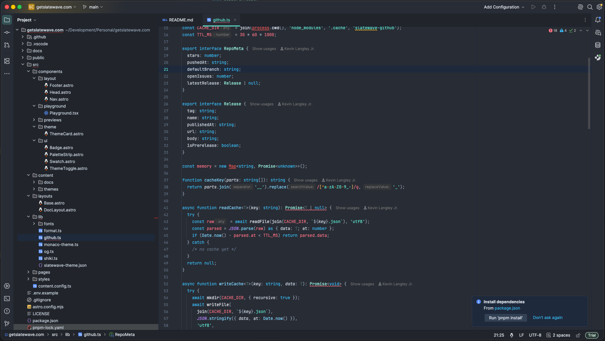

<div align="center">


<picture>
  <source media="(prefers-color-scheme: dark)" srcset="https://getslatewave.com/brand/wordmark-light.png">
  
</picture>

# Slatewave (JetBrains)

A dark [JetBrains](https://www.jetbrains.com) theme built around a slate foundation and a teal signature, with sky/rose/purple/amber accents. Part of the [Slatewave family](#slatewave-family) — one palette across editors, terminals, prompts, notes, and more.

> _Slate below, teal above._

Works in every IntelliJ-based IDE — **GoLand**, **WebStorm**, IntelliJ IDEA, PyCharm, RubyMine, PhpStorm, CLion, RustRover, DataGrip, Rider, Android Studio.



</div>

---

## What's in the box

- **UI theme** (`slatewave.theme.json`) — tool windows, tabs, status bar, buttons, popups, notifications, gutter, navigation bar. Teal signature for active tab underline, cursor, focus, and selected tree nodes; slate foundation across the chrome.
- **Editor color scheme** (`Slatewave.xml`) — syntax highlighting for Go, TypeScript/JavaScript, JSX/TSX, CSS / SCSS / LESS, HTML / XML, JSON, YAML, Markdown, Python, Bash, Docker, SQL, plus console + embedded terminal ANSI palette.

Both ship as a single plugin. Selecting **Slatewave** as the theme auto-switches the editor scheme too.

---

## Palette

### Foundation — slate

| | Hex | Tailwind | Where |
|---|---|---|---|
|  | `#020617` | slate-950 | deepest chrome borders |
|  | `#0f172a` | slate-900 | panel/border seams |
|  | `#1e293b` | slate-800 | inputs, popups, menus |
|  | `#21252b` | — | tool windows, tabs strip, status bar |
|  | `#282c34` | — | editor surface |
|  | `#334155` | slate-700 | list focus, active borders |

### Text — slate (inverse)

| | Hex | Tailwind | Where |
|---|---|---|---|
|  | `#475569` | slate-600 | gutter, ignored files, bright-black terminal |
|  | `#64748b` | slate-500 | comments, line numbers |
|  | `#94a3b8` | slate-400 | operators, muted UI, breadcrumb chevrons |
|  | `#cbd5e1` | slate-300 | parameters, properties, tree text |
|  | `#e2e8f0` | slate-200 | default foreground |
|  | `#f1f5f9` | slate-100 | bright-white terminal, selection fg |

### Signature — teal

The "wave." Primary accent across editor and the companion prompt.

| | Hex | Tailwind | Where |
|---|---|---|---|
|  | `#0f766e` | teal-700 | default buttons |
|  | `#5eead4` | teal-300 | **primary accent** — cursor, active tab underline, strings |
|  | `#99f6e4` | teal-200 | types, classes, interfaces |
|  | `#ecfeff` | cyan-50 | text on teal backgrounds |

### Accents

Each accent maps to a specific role — editor and terminal speak the same visual language as the Slatewave oh-my-posh prompt.

| | Hex | Role in prompt | Role in editor |
|---|---|---|---|
|  | `#38bdf8` | git clean branch | keywords, tags, info diagnostics, links |
|  | `#7dd3fc` | — | functions, JSON/YAML keys, CSS properties |
|  | `#B388FF` | git ahead/behind | storage, `this`/`self`, decorators-adjacent |
|  | `#fb7185` | git dirty | numbers, constants, modified files, errors |
|  | `#fbbf24` | — | annotations, Go struct tags, escape chars, warnings |
|  | `#b45309` | battery discharging | yellow terminal, deprecated markers |
|  | `#0e7490` | battery charging | cyan terminal |
|  | `#ff4500` | git diverged | merge conflicts |
|  | `#ef5350` | exit code != 0 | deleted files, invalid syntax |

---

## Syntax mapping

| Token | | Color | Style |
|---|---|---|---|
| Comments |  | `#64748b` | italic |
| Keywords (`if`, `return`, `import`, `func`) |  | `#38bdf8` | — |
| Storage / modifiers |  | `#B388FF` | italic |
| Types, classes, interfaces |  | `#99f6e4` | — |
| Primitive types (`string`, `int`, `bool`) |  | `#38bdf8` | — |
| Functions — calls + definitions |  | `#7dd3fc` | — |
| Strings |  | `#5eead4` | — |
| Template-string delimiters |  | `#B388FF` | — |
| Numbers / booleans |  | `#fb7185` | — |
| Constants (`UPPER_SNAKE`, Go consts) |  | `#fb7185` | — |
| Regex |  | `#fb7185` | — |
| Escape sequences |  | `#fbbf24` | — |
| Annotations / decorators |  | `#fbbf24` | italic |
| Go struct tags |  | `#fbbf24` | — |
| Go package / imports |  | `#5eead4` | — |
| Go receivers / Python `self` |  | `#B388FF` | italic |
| Parameters |  | `#cbd5e1` | italic |
| Properties / instance members |  | `#cbd5e1` | — |
| Operators, punctuation |  | `#94a3b8` | — |
| HTML/JSX tags |  | `#38bdf8` | — |
| HTML/JSX attributes |  | `#B388FF` | italic |
| CSS selectors |  | `#5eead4` | — |
| CSS properties |  | `#7dd3fc` | — |
| CSS pseudo selectors |  | `#fbbf24` | — |
| JSON / YAML keys |  | `#7dd3fc` | — |
| Markdown headings |  | `#5eead4` | bold |
| Markdown links |  | `#38bdf8` | underline |
| Markdown inline code |  | `#99f6e4` | — |
| Shell variables |  | `#B388FF` | — |
| Shell external commands |  | `#7dd3fc` | — |
| TODO / FIXME |  | `#fbbf24` | bold italic |
| Invalid |  | `#ef5350` | — |
| Deprecated | — | — | strikethrough |

---

## Terminal

The integrated terminal's ANSI palette is wired to the prompt's segment colors, so the companion oh-my-posh theme renders identically in the IDE terminal and any outside terminal.

| ANSI | Hex | |
|---|---|---|
| black | `#1e293b` |  |
| red | `#fb7185` |  |
| green | `#5eead4` |  |
| yellow | `#b45309` |  |
| blue | `#38bdf8` |  |
| magenta | `#B388FF` |  |
| cyan | `#0e7490` |  |
| white | `#e2e8f0` |  |

Bright variants follow the same mapping, shifted one step up the scale.

---

## Installation

### From the Marketplace

_(TBD — publish step)_

1. **Settings → Plugins → Marketplace**
2. Search "Slatewave"
3. **Install**, then **Settings → Appearance & Behavior → Appearance → Theme → Slatewave**

### From a `.zip` (local build)

```sh
make build
# → build/distributions/Slatewave-<version>.zip
```

Then in any JetBrains IDE: **Settings → Plugins → ⚙︎ → Install Plugin from Disk…** → pick the `.zip`.

`make` auto-detects a bundled JetBrains JBR for `JAVA_HOME` (Gradle needs JDK ≥ 17 to start; the system Java on macOS is often 8). Override by exporting `JAVA_HOME` before invoking `make`. Run `make` with no args for the full target list.

### From source, live

For iteration on the theme itself:

```sh
make run
```

spins up a sandbox IDE with the plugin loaded; edits to `theme.json` / `Slatewave.xml` show up on next sandbox launch.

---

## Slatewave family

One palette. Every tool.

- **Editors** — [VSCode](https://github.com/kevinlangleyjr/vscode-slatewave) · [Neovim](https://github.com/kevinlangleyjr/neovim-slatewave) · [Helix](https://github.com/kevinlangleyjr/helix-slatewave) · [Zed](https://github.com/kevinlangleyjr/zed-slatewave) · [Sublime Text](https://github.com/kevinlangleyjr/sublime-text-slatewave)
- **Terminals** — [Alacritty](https://github.com/kevinlangleyjr/alacritty-slatewave) · [Ghostty](https://github.com/kevinlangleyjr/ghostty-slatewave) · [iTerm2](https://github.com/kevinlangleyjr/iterm2-slatewave) · [WezTerm](https://github.com/kevinlangleyjr/wezterm-slatewave) · [Windows Terminal](https://github.com/kevinlangleyjr/windows-terminal-slatewave)
- **Prompts** — [Oh My Posh](https://github.com/kevinlangleyjr/slatewave-omp) · [Starship](https://github.com/kevinlangleyjr/starship-slatewave)
- **Multiplexer** — [tmux](https://github.com/kevinlangleyjr/tmux-slatewave)
- **Notes** — [Obsidian](https://github.com/kevinlangleyjr/obsidian-slatewave) · [Logseq](https://github.com/kevinlangleyjr/logseq-slatewave)
- **Launchers** — [Alfred](https://github.com/kevinlangleyjr/alfred-slatewave) · [Raycast](https://github.com/kevinlangleyjr/raycast-slatewave)
- **Chat** — [Slack](https://github.com/kevinlangleyjr/slack-slatewave)

See [getslatewave.com](https://getslatewave.com) for the full family.

---

## Customize

To tweak a specific color without forking, copy the scheme: **Settings → Editor → Color Scheme → Slatewave → ⚙︎ → Duplicate…** Overrides then live in your personal scheme; the bundled Slatewave stays pristine for updates.

---

## Contributing

Issues and PRs welcome. If you're proposing a palette change, include a before/after screenshot of the same file so the visual tradeoff is obvious.

---

## License

WTFPL – Do What The Fuck You Want To Public License. See [LICENSE](LICENSE).
